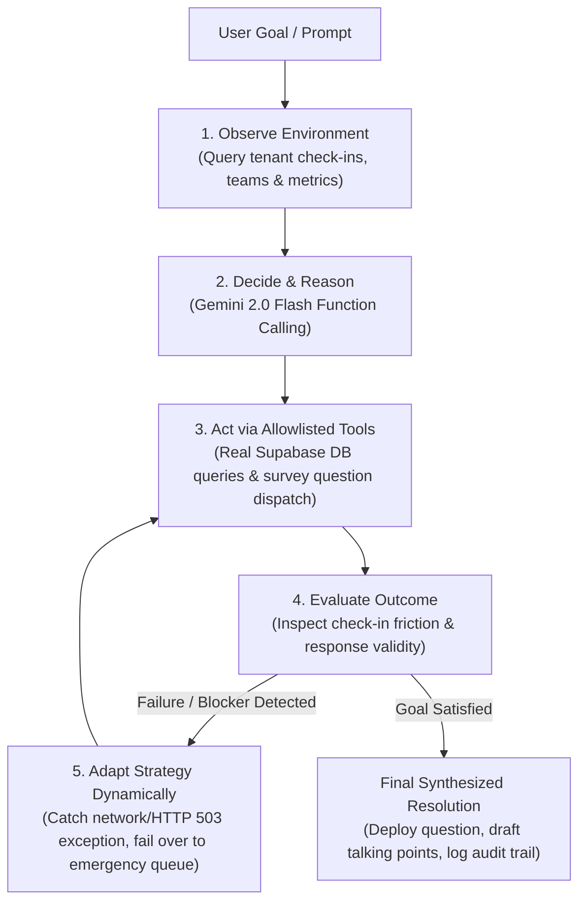

# PeoplePulse — Enterprise Multi-Tenant B2B SaaS

PeoplePulse is a production-grade, multi-tenant employee engagement and sentiment analytics platform built with React (Vite, Tailwind CSS, Lucide, Recharts) and Supabase (PostgreSQL, Row-Level Security, Edge Functions, Gemini AI).

---

## 1. Multi-Tenant Architecture & Data Isolation

### Tenancy Model
- **Organizations (organizations)**: The root tenant model supporting multi-company isolation. Each organization has a name, unique URL slug, creation timestamp, and subscription plan tier (ree | pro | enterprise).
- **Organization Memberships (organization_members)**: Maps users to organizations with explicit roles:
  - owner: Full administrative rights, billing, org settings, team and member management.
  - dmin: Member invitations, team management, org analytics.
  - manager: Scoped to manage specific teams and view aggregated team metrics ( \ge 3$).
  - employee: Submits weekly check-ins (named or strictly anonymous) and views personal wellbeing history.
- **Tenant Scoping Across Tables**:
  - 	eams.organization_id
  - checkins.organization_id
  - sentiment_results.organization_id
  - invitations.organization_id
  - organization_usage.organization_id

### Row-Level Security (RLS)
All tenant tables enforce strict PostgreSQL Row-Level Security:
- Direct cross-tenant access is rejected at the database engine level using uth.uid() in (select user_id from organization_members where organization_id = ...).
- Anonymous check-ins strictly preserve user_id = NULL. Direct SELECT access to anonymous rows is prohibited for employee and manager roles.
- Manager metrics and feedback are computed via security-definer RPC functions (get_team_aggregated_insights) enforcing the  \ge 3$ aggregation threshold.

---

## 2. Privacy & Anonymity Invariants

1. **Database-Level Constraint**:
   `sql
   constraint check_anonymous_user_id check (
     (is_anonymous = true and user_id is null) or
     (is_anonymous = false and user_id is not null)
   )
   `
2. **Atomic Token Consumption**:
   Anonymous check-ins generate a cryptographically random client-side UUID processing_token. Edge Functions invoke consume_anonymous_processing_token to atomically clear the token upon sentiment analysis, ensuring tokens cannot be re-used or linked to identity.
3. **Differential Privacy & Sample Protection ( \ge 3$)**:
   Managers and admins cannot view team engagement averages or anonymous text comments unless at least 3 distinct submissions exist for that weekly cycle.

---

## 3. Plan Limits & AI Quota Enforcement

| Dimension | Free Tier | Pro Tier | Enterprise Tier |
| :--- | :--- | :--- | :--- |
| **Active Seats** | 10 seats | 100 seats | Custom / Unlimited |
| **Teams** | 1 team | Unlimited | Unlimited |
| **Monthly AI Quota** | 10 analyses / month | Unlimited | Unlimited |
| **Privacy Threshold** |  \ge 3$ strictly enforced |  \ge 3$ strictly enforced |  \ge 3$ strictly enforced |

Limits are enforced through database triggers:
- 	rg_enforce_org_seat_limit: Prevents inserting more members into organization_members than permitted by the plan.
- 	rg_enforce_org_team_limit: Enforces max teams per organization.
- consume_org_ai_quota: Atomically decrements and verifies AI sentiment analysis quota before the Edge Function calls Google Gemini.

---

## 4. Invitation Lifecycle & Token Security

- Invitations are generated with cryptographically secure random 32-byte tokens.
- Tokens are stored exclusively as SHA-256 hashes (	oken_hash = digest(token, 'sha256')). Raw tokens are never persisted in the database.
- Joining an organization requires calling ccept_org_invitation(p_token) with a valid authenticated session matching the invited email.

---

## 5. End-to-End Verification

Automated browser CDP testing validates:
- [x] Public Homepage rendering and CTA navigation
- [x] Rejection of invalid credentials with user-friendly error alerts
- [x] Real login for Alex Morgan (alex.morgan@company.com) showing real database check-in score (80), week label (Aug 31), and Acme Corp workspace badge
- [x] Duplicate check-in submission guard (You've already submitted your check-in for this week)
- [x] Session persistence across #app and auto-forwarding from #login
- [x] Sarah Patel Manager dashboard rendering aggregated metrics and \ge 3$ privacy lock
- [x] System Admin overview rendering organization members, teams list, and live plan limits / AI quota
- [x] Zero leak of service-role keys or GEMINI_API_KEY in production client bundles

---

## 6. PulseAgent — Autonomous ReAct Agent Architecture (Agentic AI Track)

PeoplePulse features **PulseAgent**, an autonomous enterprise HR agent built specifically to demonstrate the five-stage agentic loop: **Observe → Decide → Act → Evaluate → Adapt**.

### ReAct Reasoning Loop

### Verified Tool Registry

All agent operations are restricted to allowlisted, schema-enforced tools with strict tenant scoping:

| Tool Name | Operation Type | Permission | Purpose |
| :--- | :---: | :---: | :--- |
| `get_organization_metrics` | Read | Manager+ | Queries live participation rate, team counts, and engagement score averages. |
| `list_teams` | Read | Manager+ | Discovers active teams to isolate departments experiencing high friction. |
| `diagnose_team_health` | Read | Manager+ | Analyzes dimension scores (workload, stress, support) over past 60 days. |
| `dispatch_adaptive_survey` | Write | Manager+ | Persists dynamically AI-synthesized follow-up questions to `survey_questions`. |
| `trigger_manager_action_brief` | Read | Manager+ | Formulates 3 targeted 1:1 coaching talking points for leadership. |
| `simulate_and_handle_failure` | Write / Test | Manager+ | Initiates real network delivery, catches timeout/503, and triggers adaptation. |
| `send_emergency_notification` | Write | Manager+ | Dispatches urgent notices via internal emergency escalation queue upon failover. |

---

## 7. IIT Bhubaneswar Tech Zephyr 4.0 — Technical Rubric Alignment

| Evaluation Dimension | Tech Zephyr 4.0 Requirement | PeoplePulse Architecture & Implementation |
| :--- | :--- | :--- |
| **Autonomous Execution** | Multi-step reasoning and autonomous execution beyond single-turn chatbots. | **Autonomous ReAct Agent Loop**: Iterative goal-driven reasoning using Google Gemini 2.0 Flash Function Calling, maintaining context across multi-step investigations (`agentEngine.js`). |
| **ODAEA Architecture** | Rigorous Observe → Decide → Act → Evaluate → Adapt cycle. | **Data-Driven ReAct Events**: Real-time event streaming (`GOAL`, `DECISION`, `TOOL_START`, `TOOL_RESULT`, `OBSERVATION`, `EVALUATION`, `ADAPTATION`, `CONFIRMATION_REQUIRED`, `FINAL`) with data-driven outcome analysis. |
| **Tool Interaction** | Effective utilization of external/database tools via structured JSON schemas. | **Allowlisted Tool Registry**: Tools specify OpenAPI/Gemini parameter schemas, descriptions, and required fields. `organization_id` is securely injected from session context (`toolRegistry.js`). |
| **Dynamic Adaptation** | Autonomous behavior adjustment upon encountering environmental failure. | **Real-Time Network Interception**: Actively catches network timeouts / HTTP 503 exceptions, triggers the `ADAPTATION` event, and reroutes mission-critical notices to the backup in-app queue. |
| **Data Privacy & Security** | Safe execution preserving employee confidentiality and tenant boundaries. | **Cryptographic & RLS Guarantees**: PostgreSQL Row Level Security enforces $n \ge 3$ aggregation suppression, strict tenant isolation, SHA-256 invitation token hashing, and credential redaction (`039_security_hardening_v2.sql`). |
| **Production Readiness** | Reliable live deployment and operational resilience. | **Vercel + Supabase Production**: Offline fallback planner provides seamless execution continuity when API keys are absent or rate-limited. |
